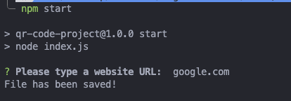

# QR Code Project

QR Code Project is a Node.js application that allows users to generate a QR code based on a URL entered in the terminal. The application saves the QR code as an image and stores the URL in a text file.

## Table of Contents

- [Project Overview](#project-overview)
- [Usage](#usage)
  - [Prerequisites](#prerequisites)
  - [Installation](#installation)
  - [Commands](#commands)
- [Built With](#built-with)
- [Author](#author)
- [License](#license)

## Project Overview

The QR Code Project prompts users to type a URL in the terminal. It then generates a QR code for the entered URL, saves the QR code as an image (`qr-image.png`), and stores the URL in a text file (`url.txt`).



## Usage

### Prerequisites

Ensure you have Node.js installed on your local machine.

### Installation

1. Clone the repository:

   ```bash
   git clone https://github.com/marventures/qr-code-nodejs.git
   cd qr-code-nodejs
   ```

2. Install dependencies:
   ```bash
   npm install
   ```

### Commands

- `npm start`: Starts the server in production mode.

## Built With

### Core

- [Node.js](https://nodejs.org/en): JavaScript runtime built on Chrome's V8 JavaScript engine.

### Utilities

- [inquirer](https://www.npmjs.com/package/inquirer): A collection of common interactive command-line user interfaces.
- [qr-image](https://www.npmjs.com/package/qr-image): A simple QR Code generator.

## Author

- GitHub - [marventures](https://github.com/marventures)
- LinkedIn - [Marvin Morales Pacis](https://www.linkedin.com/in/marventures/)
